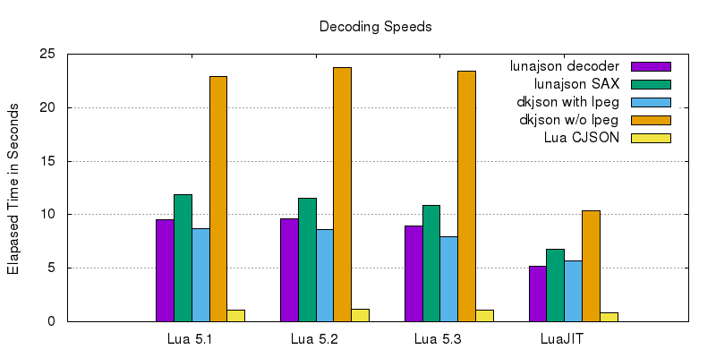
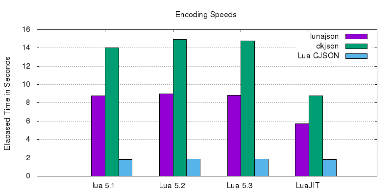

# Lunajson
Lunajson features SAX-style JSON parser and simple JSON decoder/encoder. It is tested on Lua 5.1, Lua 5.2, Lua 5.3, and LuaJIT.
It is written only in pure Lua and has no dependencies. Even though, since it is carefully optimized, decoding speed even matches to other lpeg-based JSON modules.
The parser and decoder reject inputs not conforms the JSON specification (ECMA-404), and the encoder always yields outputs conforming the specification.
The parser and decoder also handle surrogate pair correctly.

## Install
	luarocks install lunajson

Or you can download source manually and copy `src/*` into somewhere inside `package.path`.

## Simple Usage
	local lunajson = require 'lunajson'
	local jsonstr = '{"Hello"=["lunajson",1.0]}'
	local t = lunajson.decode(jsonstr)
	print(t.Hello[2]) -- prints 1.0
	print(lunajson.encode(t)) -- prints {"Hello"=["lunajson",1.0]}

## API
### lunajson.decode(jsonstr, [pos, [nullv, [arraylen]]])
Decode `jsonstr` `null` inside JSON will be codes as `nullv` if specified and discarded if not specified. If `pos` is specified it starts decoding from `pos` until JSON ends, and otherwise the entire `jsonstr` is considered as a valid JSON.
This function returns the decoded value if `jsonstr` contains a valid JSON, and otherwise an error will occur. If `pos` is specified it also returns the position immediately after the end of decorded JSON.
If `arraylen` is true, the length of an array `ary` will be stored in `ary[0]`. This behavior is useful when empty arrays should not be confused with empty objects.

### lunajson.encode(value, [nullv])
Encode `value` into a JSON and returns the JSON as a string. If `nullv` is specified, values equal to `nullv` will be encoded as `null`.

This function encode a table `t` as an array if a value `t[1]` is present or a number `t[0]` is present. If `t[0]` is present, its value is considered as the length of the array. Then the array may contain `nil` and those will be encoded as `null`. Otherwise, this function scans non `nil` values starting from index 1. When the table `t` is not an array, it is an object and its all keys must be string.

### lunajson.newparser(input, saxtbl)
### lunajson.newfileparser(filename, saxtbl)
Create a sax parser context which parses `input` or a file specified by `filename`. `input` can be a string to be parsed, or a function that repeatedly returns a chunk of a string to be parsed and `nil` when all inputs are yielded. Following is a sample function of `input` (this sample is essentially same as the implementation of `newfileparser`). Notice that `input` never called once it have returned `nil`.

	local fp = io.open("myfavorite.json")
	local function input()
		local s
		if fp then
			s = fp:read(8192)
			if not s then
				fp:close()
				fp = nil
			end
		end
		return s
	end

`saxtbl` can have following functions. Those function will be called on corresponding events.

- startobject()
- key(s)
- endobject()
- startarray()
- endarray()
- string(s)
- number(n)
- boolean(b)
- null()

A parser context have its position, initially 1.

#### parsercontext.run()
Start parsing from current position. If valid JSON is parsed, the position moves to just after the end of this JSON. Otherwise it errors.

#### parsercontext.tellpos()
Return current position.

#### parsercontext.tryc()
Return the byte of current position as a number. If input is ended, it returns `nil`. It does not change current position.

#### parsercontext.read(n)
Return the `n`-length string starting from current position, and increase the index by `n`. If the input ends, the returned string and the updated position will be truncated.

## Benchmark
Following graphs are the results of the benchmark, decording [`simple.json`](test/decodeparse/benchjson/simple.json) (about 750KiB) 100times and encoding [`simple.lua`](test/encode/benchdata/simple.lua) (the decoded result of `simple.json`) 100times. I conducted benchmarks of lunajson 1.0, [dkjson 2.5](http://dkolf.de/src/dkjson-lua.fsl/home) and [Lua CJSON 2.1.0](http://www.kyne.com.au/~mark/software/lua-cjson.php). Dkjson is a popular JSON encoding/decoding library in Lua, which is written in Lua and optionally uses [lpeg](http://www.inf.puc-rio.br/~roberto/lpeg/) to spped up decoding. Lua CJSON is a JSON encoding/decoding library written in C and inherently fast.

This benchmark is conducted in my desktop machine that equips Core i5 3550K and DDR3-1600 memory. Lua implementations and concerning modules are compiled by GCC 4.9.2 with `-O2 -march=ivybridge -mtune=ivybridge` option. Exact version of Lua interpreters are Lua 5.1.5, Lua 5.2.4, Lua 5.3.0 and LuaJIT 2.0.3. The version of lpeg is 0.12.

In this benchmark lunajson works well considering that it is implemented only in standard Lua, especially in LuaJIT benchmark. Lunajson also supplies incremental parsing in SAX-style API, therfore you don't have to load whole large JSON files into memory in order to scan the intrested informations from them. I think lunajson is especially useful when non-standard library cannot be used easily or incremental parsing is favored.

## Tokening of numbers
If you parsing a file from a specific position, there is an ambiguity when a number starts at the position.

For example, if there is `01`, `0.` or `0+` at the position, the parser could only recognize `0` as a valid JSON and returns 0, or reports an error as an invalid number.

In lunajson, first the longest string matches to `-?[0-9]+(.[0-9]*)?([eE][-+0-9]*)?` (in a regular expression) is tokenized as a number, then this number is checked whether it conforms the specification. Therefore, `01` and `0.` are rejected immediately as a invalid number and `0+` are not rejected. I think this is somewhat reasonable behavior.
